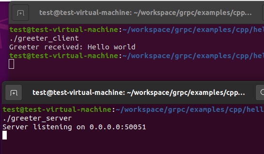

# 预处理

```
export MY_INSTALL_DIR=$HOME/.local
mkdir -p $MY_INSTALL_DIR
export PATH="$MY_INSTALL_DIR/bin:$PATH"
sudo apt install -y cmake
sudo apt install -y build-essential autoconf libtool pkg-config
sudo apt install g++ git


git clone --recurse-submodules -b v1.58.0 --depth 1 --shallow-submodules https://github.com/grpc/grpc
cd grpc
git submodule update --init


cd grpc
mkdir -p cmake/build
pushd cmake/build
cmake -DgRPC_INSTALL=ON \
      -DgRPC_BUILD_TESTS=OFF \
      -DCMAKE_INSTALL_PREFIX=$MY_INSTALL_DIR \
      ../..
make -j 4
make install
popd
```


执行：

```
cd examples/cpp/helloworld/
mkdir -p cmake/build
pushd cmake/build
cmake -DCMAKE_PREFIX_PATH=$MY_INSTALL_DIR ../..
make -j 4
```


生成的文件在`grpc/example/cpp/helloworld/cmake/build`目录下



