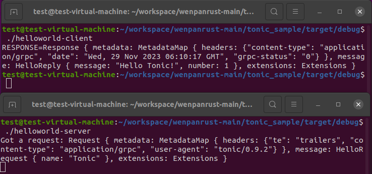

`Cargo.toml`文件是项目的元数据，其中列出了我们使用的依赖/外部库列表。
`src/main.rs`文件，则是二进制文件的入口点


## 使用方法：

在`Cargo.toml`同级目录，打开终端：

```bash
sudo cargo build
```

此时会出现target目录，里面的`target/debug/`中找到对应的二进制文件即可。helloworld-client、helloworld-server、tonic_sample。


具体步骤为：先运行helloworld-server，然后运行helloworld-client。结果如下所示。




## 预处理

```bash
sudo apt install cargo
sudo apt install protobuf-compile

# 验证，在终端输入
cargo --version # 1.70.0
protoc --version # 3.6.1
```

