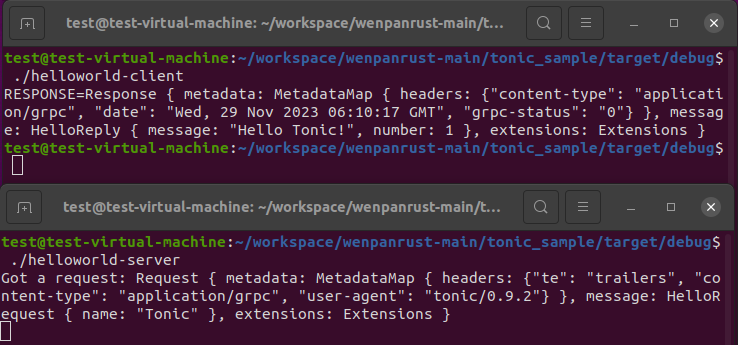

The `Cargo.toml` file is the metadata for the project, which lists the dependencies/external libraries we use.
The `src/main.rs` file is the entry point for the binary file


## Usage：

In the `Cargo.toml` sibling directory, open the terminal:

```bash
sudo cargo build
```

The target directory will appear. You can find the corresponding binary file in `target/debug/`.


To do this, run helloworld-server and then helloworld-client. The results are shown below.




## preprocessing：

```
sudo apt install cargo
sudo apt install protobuf-compile

# Verify, enter in the terminal
cargo --version # 1.70.0
protoc --version # 3.6.1
```

